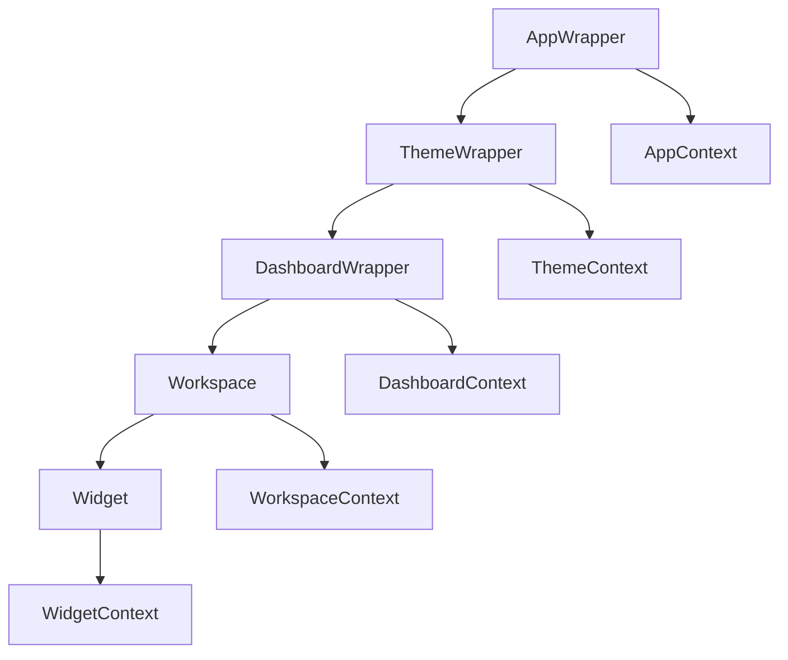
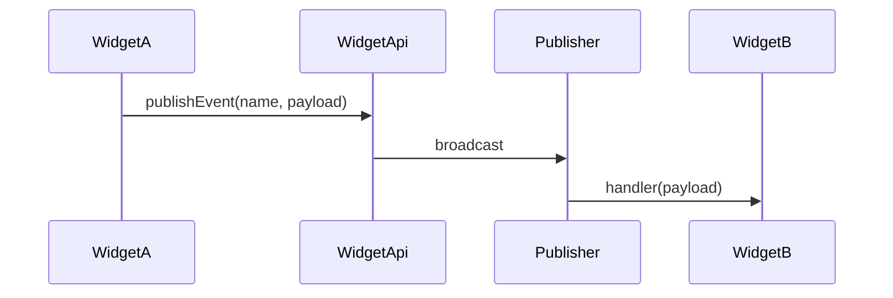
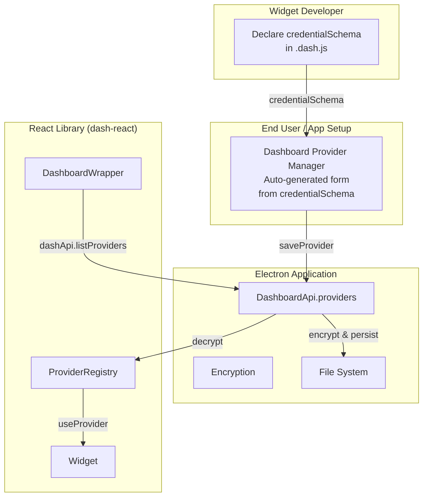
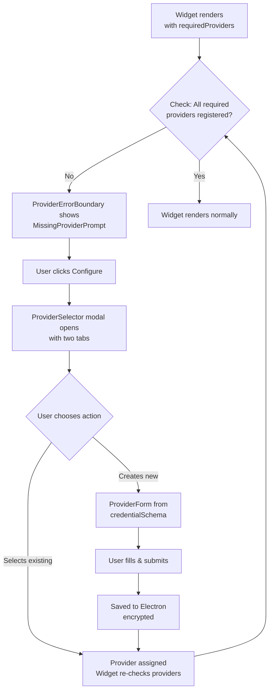

# dash-react

Dash React is a dashboard framework built around **Workspaces** and **Widgets**. It provides a core component set, theming, and a context-driven API surface to make it easy to compose complex dashboards and plug in custom widgets.

Examples of dashboards powered by Dash:

- Algolia Search
- Google Drive
- Contentful
- Slack
- ChatGPT

## Requirements

- Node.js + npm

## Installation

```bash
npm install
```

## Common Commands

```bash
npm run storybook
npm run build-storybook
npm run build
npm run build:css
npm run prod
```

## Maintainer Guide (Account Owner)

### Update UI Components

1. Edit the component files under:
    - `src/Common` (core UI primitives)
    - `src/Layout` (layout and container primitives)
    - `src/Menu` (navigation UI)
    - `src/Dashboard` (dashboard-specific UI)
    - `src/Theme` (theme manager UI)
2. If Tailwind classes or tokens change, run:

```bash
npm run build:css
```

### Test UI Changes in Storybook

```bash
npm run storybook
```

Build the static Storybook (CI or preview builds):

```bash
npm run build-storybook
```

### Update and Release the Package

```bash
npm version patch
npm run prod
git push origin main
```

## Architecture Overview

Dash uses a layered provider model to supply context to Workspaces and Widgets:



**Key contexts**:

- `AppContext`: application-level settings, credentials, debug flags
- `ThemeContext`: generated theme tokens for `bg-*`, `text-*`, `border-*`
- `DashboardContext`: dashboard APIs, publisher, and Electron bridge
- `WorkspaceContext`: workspace-level dependencies and data
- `WidgetContext`: widget instance metadata (`uuid`, etc.)

### Widget Communication (Publish/Subscribe)

Widgets can publish events and register listeners via the `WidgetApi`.



## Platform Structure (Owner View)

**What is a Workspace?**

- A container that hosts widgets and optionally provides additional contexts.

**What is a Widget?**

- A reusable UI module rendered inside a workspace. Widgets use `WidgetApi` and contexts for communication and data.

**What is a Widget Config?**

- A `.dash.js` file that registers a widget/workspace and its metadata (workspace name, type, userConfig).

**Where are widgets stored?**

- `src/Widgets/<WidgetName>/` with `contexts`, `hooks`, `widgets`, and `workspaces` subfolders.

## Widget Development

Widgets are grouped under `src/Widgets/<WidgetName>/` with a workspace, widget, context, and optional hooks.

```
src/Widgets/MyWidget/
  contexts/
  hooks/
  widgets/
  workspaces/
  index.js
```

### Widget Config Files

Each widget and workspace has a `.dash.js` configuration file.

```js
// MyWidget.dash.js
import { MyWidget } from "./MyWidget";

export default {
    component: MyWidget,
    canHaveChildren: false,
    workspace: "my-cool-workspace-name",
    type: "widget",
};
```

```js
// MyWidgetWorkspace.dash.js
import { MyWidgetWorkspace } from "./MyWidgetWorkspace";

export default {
    component: MyWidgetWorkspace,
    canHaveChildren: true,
    workspace: "my-cool-workspace-name",
    type: "workspace",
};
```

### User Configurable Widgets

Widget configuration can expose user-editable settings in the dashboard UI:

```js
export default {
    component: MyWidget,
    canHaveChildren: false,
    workspace: "MyWidgetWorkspace-workspace",
    type: "widget",
    userConfig: {
        title: {
            type: "text",
            defaultValue: "default",
            instructions: "Type a heading for your widget",
            displayName: "Title",
            required: true,
        },
        subtitle: {
            type: "text",
            defaultValue: "Im a subtitle",
            instructions: "Type a subtitle for your widget",
            displayName: "Sub Title",
        },
    },
};
```

## Hooks Strategy (Core + Custom)

The core library provides `useDashboard()` which returns `app`, `dashboard`, and `theme` contexts.

```js
import { useDashboard } from "@dash/hooks";

const { app, dashboard, theme } = useDashboard();
```

Widget developers should create their own hook to combine core contexts with custom widget contexts:

```js
// src/Widgets/AlgoliaSearch/hooks/useAlgoliaSearch.js
import { useContext } from "react";
import { useDashboard } from "@dash/hooks";
import { SearchContext } from "../contexts/SearchContext";

export const useAlgoliaSearch = () => {
    const { app, dashboard, theme } = useDashboard();
    const search = useContext(SearchContext);

    if (!search) {
        throw new Error(
            "useAlgoliaSearch must be used within AlgoliaSearchWorkspace"
        );
    }

    return { app, dashboard, theme, search };
};
```

## WidgetApi (Core Communication)

`WidgetApi` provides publish/subscribe and data storage APIs. It is available via `DashboardContext` and through widgets that receive `api`.

Common usage:

```js
dashboard.widgetApi.publishEvent(name, payload);
dashboard.widgetApi.registerListeners(listeners, handlers);

api.storeData(data);
api.readData({
    callbackComplete: (data) => {},
    callbackError: (e) => {},
});
```

## Themes and Usage

Themes are generated by `ThemeWrapper` and exposed via `ThemeContext`.

```js
import { useDashboard } from "@dash/hooks";

const { theme } = useDashboard();
const colors = theme.currentTheme;

// Example token
const className = colors["text-secondary-very-light"];
```

Theme tokens are consistent across components and include:

- `bg-*`, `text-*`, `border-*`
- variants like `very-light`, `light`, `medium`, `dark`, `very-dark`

## App and Dashboard Contexts

Use the core hook to access application and dashboard state:

```js
import { useDashboard } from "@dash/hooks";

const { app, dashboard } = useDashboard();

// app.settings, app.creds, app.debugMode
// dashboard.widgetApi, dashboard.dashApi, dashboard.credentials
```

## Provider Registry Pattern

Widgets can require external services (APIs, databases, etc.) that need authentication. The **Provider Registry** pattern allows:

1. **Schema-driven**: Developers define credential requirements in widget config
2. **Secure storage**: Electron app handles credential encryption and file persistence
3. **Auto-generated UI**: Forms are generated automatically from credential schemas
4. **One-time setup**: End users provide credentials once, reused across widgets
5. **Multi-instance support**: Same provider type with different credentials (e.g., "algolia-prod", "algolia-staging")

### Architecture & Data Flow



### Setting Up Providers in DashboardWrapper

The DashboardWrapper loads providers from persistent storage on startup:

```js
import {
    DashboardWrapper,
    ProviderContext,
    createProviderRegistry,
} from "@dash";

const DashboardSetup = () => {
    const providerRegistry = createProviderRegistry();

    // Load persisted providers from Electron app
    useEffect(() => {
        dashApi.listProviders(
            appId,
            (event, data) => {
                // data.providers = [
                //   {
                //     name: "algolia-prod",
                //     type: "algolia",
                //     credentials: {
                //       appId: "xxx",
                //       apiKey: "yyy",
                //       indexName: "products"
                //     }
                //   },
                //   {
                //     name: "algolia-staging",
                //     type: "algolia",
                //     credentials: {
                //       appId: "aaa",
                //       apiKey: "bbb",
                //       indexName: "staging"
                //     }
                //   }
                // ]

                // Store each provider by name (Electron has already decrypted)
                data.providers.forEach((provider) => {
                    providerRegistry.addProvider(provider.name, provider);
                });
            },
            (event, error) => {
                console.error("Failed to load providers", error);
            }
        );
    }, []);

    return (
        <ProviderContext.Provider value={providerRegistry}>
            <DashboardWrapper dashApi={dashApi} credentials={credentials}>
                {/* Dashboard content */}
            </DashboardWrapper>
        </ProviderContext.Provider>
    );
};
```

### Widget Declaration of Provider Requirements

Widget developers declare what credentials they need using a `credentialSchema`:

```js
// src/Widgets/AlgoliaSearch/widgets/AlgoliaSearchWidget.dash.js
import { AlgoliaSearchWidget } from "./AlgoliaSearchWidget";

export default {
    component: AlgoliaSearchWidget,
    canHaveChildren: false,
    workspace: "AlgoliaSearchWorkspace-workspace",
    type: "widget",

    // Define what credentials are needed for this provider type
    requiresProviders: [
        {
            type: "algolia",
            credentialSchema: {
                appId: {
                    type: "text",
                    displayName: "Application ID",
                    instructions: "Your Algolia Application ID",
                    required: true,
                    secret: true, // masks input, stored encrypted
                },
                apiKey: {
                    type: "text",
                    displayName: "API Key",
                    instructions: "Your Algolia API Key",
                    required: true,
                    secret: true,
                },
                indexName: {
                    type: "text",
                    displayName: "Index Name",
                    instructions: "Default Algolia index to search",
                    required: true,
                    secret: false, // not sensitive
                },
            },
        },
    ],

    // Widget config: which provider to use
    userConfig: {
        providerName: {
            type: "provider",
            providerType: "algolia",
            displayName: "Select Algolia Provider",
            instructions: "Choose a registered Algolia provider",
            required: true,
        },
    },
};
```

### Using a Provider in a Widget

Widgets use the `useProvider()` hook to access credentials and instantiate their own clients:

```js
// src/Widgets/AlgoliaSearch/widgets/AlgoliaSearchWidget.js
import { useProvider } from "@dash/Context";
import algoliasearch from "algoliasearch";

export const AlgoliaSearchWidget = ({ providerName }) => {
    // Get credentials for this provider
    const credentials = useProvider(providerName);
    // credentials = { appId: "xxx", apiKey: "yyy", indexName: "products" }

    // Instantiate client with credentials
    const algoliaClient = algoliasearch(credentials.appId, credentials.apiKey);

    const handleSearch = async (query) => {
        const results = await algoliaClient.search([
            {
                indexName: credentials.indexName,
                query,
            },
        ]);
        return results;
    };

    return (
        <Widget>
            <Panel>
                <input
                    placeholder="Search..."
                    onChange={(e) => handleSearch(e.target.value)}
                />
            </Panel>
        </Widget>
    );
};
```

### Provider Selection UI (Missing Provider Prompt)

When a widget requires a provider but none is selected, the framework automatically displays a **Missing Provider Prompt** instead of the widget content. This guides end users through provider setup without requiring any additional wrapper components.

#### Automatic Detection (ProviderErrorBoundary)

Each widget instance includes built-in provider detection via `ProviderErrorBoundary`:

1. **Automatic Check**: On mount and when props change, the boundary checks if all required providers are registered
2. **Independent Handling**: Each widget independently detects missing providers—if one widget needs setup, other widgets still render normally
3. **Scoped Prompt**: The `MissingProviderPrompt` is specific to that widget and its required providers only

This means dashboards with multiple widgets can have some widgets showing setup prompts while others function normally—the entire dashboard doesn't block.

#### User Experience Flow



#### MissingProviderPrompt Component

The `MissingProviderPrompt` is displayed automatically by `ProviderErrorBoundary` when a widget requires providers that aren't registered. Developers typically don't instantiate it directly—it's handled by the framework.

However, for reference, the component accepts:

```js
import { MissingProviderPrompt } from "@dash/Provider";

<MissingProviderPrompt
    requiredProviders={[
        {
            type: "algolia",
            credentialSchema: {
                appId: { type: "text", required: true, secret: true },
                apiKey: { type: "text", required: true, secret: true },
                indexName: { type: "text", required: true },
            },
        },
    ]}
    onProviderSelect={(providerType, providerName, credentials) => {
        // Handle provider selection
        // Save to DashboardApi if new provider
        // Update widget config if existing provider
    }}
/>;
```

**Features**:

- Shows count of missing required providers
- Lists what fields each provider requires
- One-click "Configure" button per provider type
- Visual hint about selecting vs creating

#### Using ProviderErrorBoundary Directly

If you need manual control over provider detection (rare), use `ProviderErrorBoundary` directly:

```js
import { ProviderErrorBoundary } from "@dash/Provider";

<ProviderErrorBoundary
    requiredProviders={["algolia", "slack"]}
    widgetId="my-widget-123"
    onProviderSelect={(type, name, credentials) => {
        // Save provider association
    }}
>
    <YourWidgetComponent />
</ProviderErrorBoundary>;
```

**Props**:

- `requiredProviders`: Array of provider type strings the widget needs
- `widgetId`: Unique ID for tracking this provider boundary (typically UUID)
- `onProviderSelect`: Callback when user selects or creates a provider
- `children`: The widget or component to wrap

#### ProviderSelector Modal

The `ProviderSelector` is a two-tab modal:

**Tab 1: Select Existing**

- Filters available providers by type
- Shows provider name, type, and fields
- Click to select and close modal

**Tab 2: Create New**

- Uses `ProviderForm` to render credential input
- Dynamically generates form from `credentialSchema`
- Validates required fields
- On submit, creates provider and passes back to widget

```js
import { ProviderSelector } from "@dash/Provider";

<ProviderSelector
    isOpen={isOpen}
    setIsOpen={setIsOpen}
    providerType="algolia"
    existingProviders={allProviders}
    credentialSchema={{
        appId: {
            type: "text",
            displayName: "Application ID",
            instructions: "Your Algolia Application ID",
            required: true,
            secret: true,
        },
        apiKey: {
            type: "text",
            displayName: "API Key",
            instructions: "Your Algolia API Key",
            required: true,
            secret: true,
        },
        indexName: {
            type: "text",
            displayName: "Index Name",
            instructions: "Default Algolia index",
            required: true,
            secret: false,
        },
    }}
    onSelect={(providerName) => {
        // Provider selected - update widget
    }}
    onCreate={(providerName, credentials) => {
        // New provider created
        // Save via dashApi.saveProvider()
        // Update widget with new provider name
    }}
/>;
```

#### ProviderForm Component

The `ProviderForm` dynamically renders form fields based on credential schema:

```js
import { ProviderForm } from "@dash/Provider";

<ProviderForm
    credentialSchema={{
        appId: {
            type: "text",
            displayName: "Application ID",
            instructions: "Your Algolia Application ID",
            required: true,
            secret: true
        },
        apiKey: { ... }
    }}
    initialValues={{}}  // For edit mode, pass existing values
    onSubmit={(formData) => {
        // formData = { appId: "xxx", apiKey: "yyy", indexName: "products" }
        // Send to Electron for encryption and storage
    }}
    onCancel={() => {
        // Handle cancel
    }}
    submitLabel="Create Provider"
/>
```

**Field Features**:

- Renders text inputs with labels and instructions
- Marks required fields with asterisk
- Secret fields (`secret: true`) use `type="password"`
- Validates all required fields before submit
- Clears error messages as user corrects input
- Shows helpful error messages for validation failures

#### Wrapping Widgets with Provider Detection

Use `ProviderAwareWidget` wrapper to automatically handle missing providers:

```js
import { WidgetProviderWrapper } from "@dash/Provider";

export const AlgoliaSearchWidget = ({ providerName }) => {
    // Widget implementation
    return <Widget>{/* content */}</Widget>;
};

// In your workspace or parent component:
export const AlgoliaSearchWorkspace = ({ registeredProviders }) => {
    return (
        <WidgetProviderWrapper
            requiredProviders={[
                {
                    type: "algolia",
                    credentialSchema: {
                        /* ... */
                    },
                },
            ]}
            registeredProviders={registeredProviders}
            onProviderSelect={(type, name, credentials) => {
                // Handle provider selection
            }}
        >
            <AlgoliaSearchWidget providerName={selectedProvider} />
        </WidgetProviderWrapper>
    );
};
```

Or use the higher-order component pattern:

```js
import { withProviderDetection } from "@dash/Provider";

const WrappedWidget = withProviderDetection(AlgoliaSearchWidget, {
    requiredProviders: [
        {
            type: "algolia",
            credentialSchema: {
                /* ... */
            },
        },
    ],
    registeredProviders: providers,
    onProviderSelect: (type, name) => {
        // Handle provider selection
    },
});
```

### ProviderContext API

```js
import { useProvider, createProviderRegistry } from "@dash/Context";

const registry = createProviderRegistry();

// Add a provider (with its credentials)
registry.addProvider("algolia-prod", {
    name: "algolia-prod",
    type: "algolia",
    credentials: { appId: "xxx", apiKey: "yyy", indexName: "products" },
});

// Access provider credentials in a widget
const credentials = useProvider("algolia-prod");
// Returns: { appId: "xxx", apiKey: "yyy", indexName: "products" }

// List all registered providers
const providers = registry.listProviders();
// Returns: ["algolia-prod", "algolia-staging", ...]

// Get a provider
const provider = registry.getProvider("algolia-prod");
// Returns: { name: "algolia-prod", type: "algolia", credentials: {...} }

// Remove a provider
registry.removeProvider("algolia-prod");
```

### Best Practices

1. **Define schema in `.dash.js`**: Declare all required credentials upfront
2. **Mark sensitive fields**: Use `secret: true` for API keys, passwords, tokens
3. **Validate credentials early**: Check for required fields in schema
4. **Instantiate on-demand**: Create API clients when widget mounts, not at load time
5. **Handle missing providers**: `useProvider()` throws if provider doesn't exist—catch at workspace level
6. **Use meaningful names**: "algolia-prod", "contentful-draft" are clearer than "provider1"

## UI Components (Core Library)

Below is a list of commonly used UI components exposed by the core library. Many are in `src/Common` and are intended for use inside Workspaces and Widgets.

- **`Dashboard`**: main dashboard container and layout host
- **`Workspace`**: context-enabled container for widgets
- **`Widget`**: base widget wrapper with error boundary
- **`LayoutContainer`**: flexible layout container for rows/columns
- **`Panel`**: styled container panel
- **`DashPanel`**: dashboard panel wrapper with built-in styles
- **`Container`**: generic layout container with spacing utilities
- **`Header` / `SubHeader` / `Footer`**: layout headers and footers
- **`MainLayout` / `MainSection` / `MainContent`**: page-level layout primitives
- **`Menu` / `MenuItem`**: in-widget menu and list items
- **`MainMenu` / `SideMenu` / `DashboardMenuItem`**: dashboard navigation UI
- **`Button` / `ButtonIcon`**: primary action components
- **`Modal`**: modal overlay component
- **`Notification` / `NotificationCancel`**: alert and dismissal UI
- **`SlidePanelOverlay`**: slide-in panel overlay
- **`Tag`**: label/tag UI component
- **`Toggle`**: toggle switch component
- **`ErrorBoundary` / `ErrorMessage`**: error handling UI
- **`CodeEditor` / `CodeRenderer`**: code input and rendering components
- **`Form`**: form inputs and utilities
- **`Text`**: text primitives and typography helpers
- **`Draggable`**: drag-and-drop helpers for layout widgets

## Theme Overrides

Common style override props:

```
backgroundColor
borderColor
textColor
hoverBackgroundColor
hoverTextColor
hoverBorderColor
padding
```

Example:

```jsx
<Panel borderColor="border-green-200" />
```

## Widget Data Storage

Dash exposes a simple widget data API via `WidgetApi`:

```js
api.storeData(data);

api.readData({
    callbackComplete: (data) => {},
    callbackError: (e) => {},
});
```

## Contact

For access and support: john.giatropoulos@gmail.com
